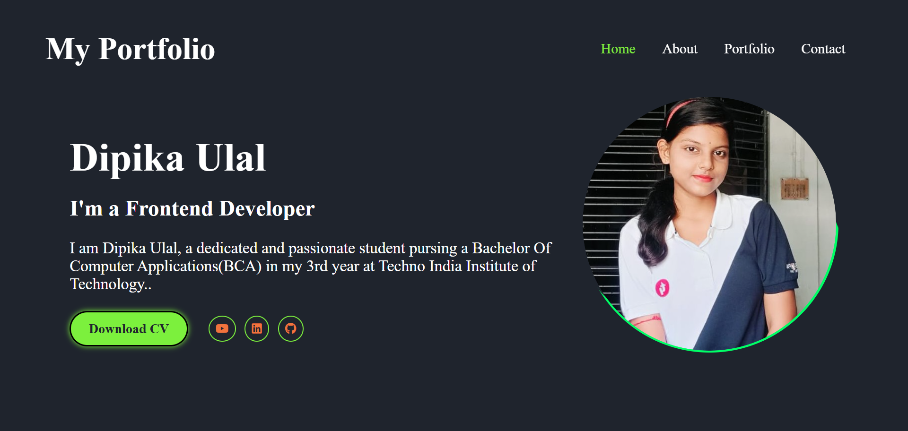

# Personal Portfolio Website

This project is a personal portfolio website designed to showcase skills, projects, and experience. It is built using HTML and CSS.

## Features
- Responsive design
- Project showcase section
- About and contact information

## Files
- `project2.html`: Main HTML file for the website
- `project2.css`: CSS file for styling the website
- `dipika project.png.jpg`, `screenshot.png`: Images used in the website

## Usage
Open `project2.html` in your web browser to view the portfolio website.

## Screenshots

## License
This project is for personal use and demonstration purposes.
